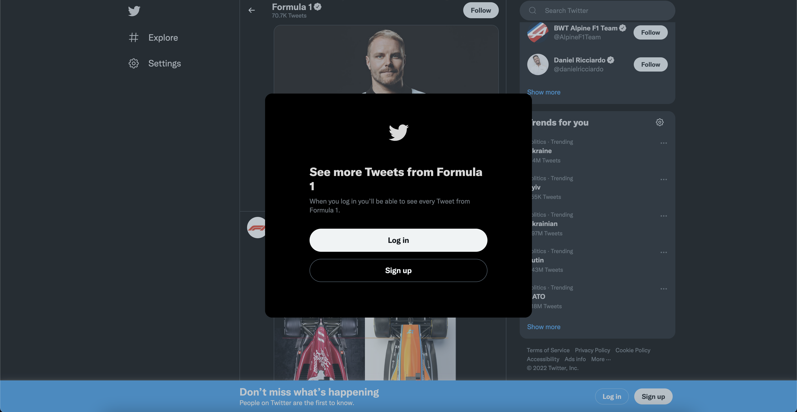
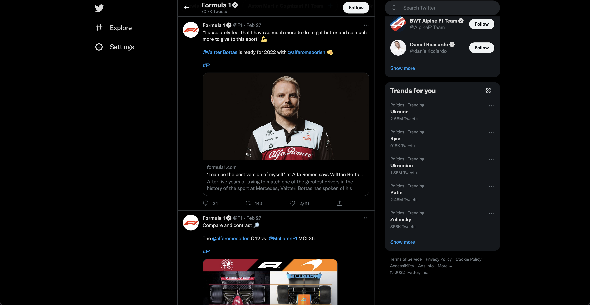

# Bypass twitter login wall

A web extension that removes the twitter login wall.

<div style="display: flex; flex-wrap: wrap;">
    <div style="flex: 1; margin-right: 10px; margin-bottom: 10px;">
        <h6>Without extension</h6>
        
    </div>
    <div style="flex: 1;">
        <h6>With extension</h6>
        
    </div>
</div>

## Development

Before developing, install node LTS and yarn.

Then run

```sh
yarn
yarn start

# In a new terminal tab run
yarn start:firefox
# or
yarn start:chrome
```

## Build

Run a build using

```sh
yarn build
```

This will output a production build in `dist` and a `.zip` file ready for submission.
